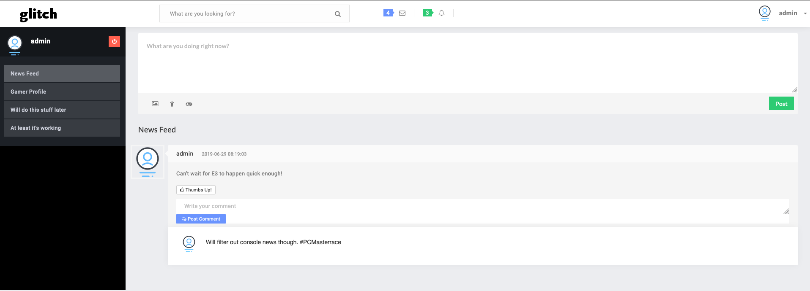

# Glitch Social Network

## About
Web Engineering (4th semester) project

The project aims to build a social network for gamers where they can interact with each other. Essentially, they will be able to communicate with gamers by sharing their achievements and goals. Help and request for assistance at a particular stage in a particular game will be available, wherein users will help each other overcome hurdles in their quests.

Update: 6th June, 2015

Features added:

- Fully working GUI with backend mySQL and Apache
- Registering & signing
- Uploading statuses, brags, "now-playing"
- Commenting on statuses, brags

Features to implement:

- notifications
- IMs
- Search
- Friends
- ... and much much more

## Development

* Clone the repo
* `docker-compose build`
* `docker-compose up -d` (starts containers `mysql-container` and `php-container` in detached mode)

#### Optional Commands
* `docker system prune --volumes` (skip `--volumes` to keep persistent volume data (MySQL))
* To enter MySQL container's bash shell: `docker exec -it mysql-container bash`
* To enter PHP container's bash shell: `docker exec -it php-container bash`
* Log into MySQL interpreter from within the MySQL container: `mysql -uroot -p -h localhost`